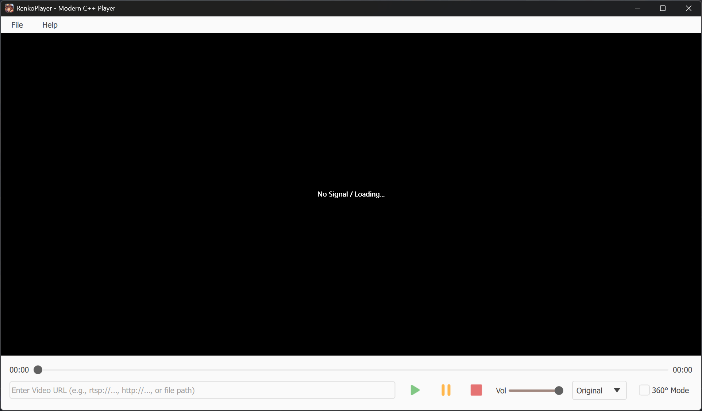
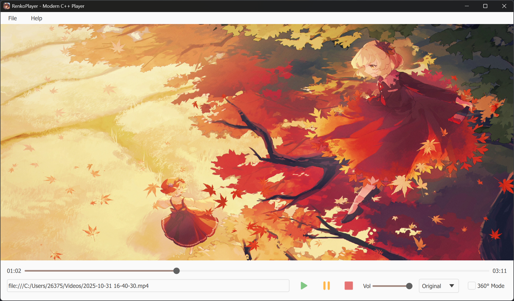

# RenkoPlayer

一个基于 **C++20**、**Qt 6** 和 **FFmpeg** 构建的视频播放器。

## 功能
- 支持多种视频格式和协议（本地文件、RTSP 流）
- 3D 视频播放支持（切换到360°模式，通过鼠标交互可拖拽视角）

## 演示
<p align="left">
    
    
</p>

## 技术栈
- **语言**: C++20
- **框架**: Qt 6.8.3
- **媒体引擎**: FFmpeg 8.0
- **构建系统**: CMake 3.20+
- **包管理器**: vcpkg

## 开发环境搭建 (Windows)

### 前置要求
1.  **Visual Studio Code** (需安装 CMake Tools 和 C++ 插件)。
2.  **vcpkg**: 已安装并集成到系统或 VS Code 中。

### 构建指南
本项目使用 **vcpkg Manifest Mode**，你**不需要**手动运行 `vcpkg install`，CMake 会在配置阶段自动处理所有依赖。

#### 方式一：使用 VS Code (推荐)

1. **克隆仓库**:
    ```powershell
    git clone https://github.com/Shionyori/RenkoPlayer.git
    cd RenkoPlayer
    code .
    ```

2.  **配置 CMake**:
    *   在 VS Code 底部状态栏选择构建预设：**"Windows Release (vcpkg)"**。
    *   *注意*: 首次配置可能需要较长时间（30-60分钟），因为 vcpkg 需要从源码编译 Qt6 和 FFmpeg。

3.  **编译与运行**:
    *   使用快捷键 `Ctrl+Shift+B` 进行编译。
    *   编译完成后，按 `F5` 运行程序。

#### 方式二：使用命令行 (CLI)
如果你更喜欢使用终端，请确保已安装 CMake 和 vcpkg，并正确设置了环境变量。

1.  **配置 (Configure)**:
    请将 `[path/to/vcpkg]` 替换为你本地的 vcpkg 安装路径。
    ```powershell
    cmake -B build -S . -DCMAKE_TOOLCHAIN_FILE=[path/to/vcpkg]/scripts/buildsystems/vcpkg.cmake
    ```

2.  **构建 (Build)**:
    ```powershell
    cmake --build build --config Release
    ```

3.  **运行 (Run)**:
    ```powershell
    .\build\Release\RenkoPlayer.exe
    ```

## 项目结构
```
RenkoPlayer/
├── assets/            # 资源文件
├── qml/               # QML 界面文件
├── src/
│   ├── core/          # FFmpeg 解码核心逻辑
│   ├── ui/            # Qt 界面相关代码
│   └── main.cpp       # 程序入口
├── libs/
│   └── RenkoUI/       # 自定义 QML 组件库
│       ├── assets/
│       ├── qml/
│       ├── src/
│       └── CMakeLists.txt
├── docs/
│   ├── demo/          # 演示图片与视频
│   └── dev_logs/      # 开发日志与故障排查记录
├── vcpkg.json         # 依赖清单文件
└── CMakeLists.txt     # CMake 构建配置
```

## 文档
查看 [docs/dev_logs](./docs/dev_logs/) 目录以了解开发日志和故障排查过程。

## 待办事项
- [ ] 增加播放列表和用户界面功能
- [ ] 添加常用快捷键 (空格暂停、方向键快进/音量)
- [ ] 增加操作栏自动隐藏功能
- [ ] 优化 3D 模式下的性能表现